Case Studies and Empirical Results 

```
0.1 Data description....................................... 1
0.2 Traditional Methods: Comparison.............................. 1
0.3 Standard Machine Learning Methods: SVM and Decision tree, comparison........ 3
0.4 Comparison with deep learning methods: LSTM...................... 4
0.5 Reinforcement learning methods.............................. 6
0.6 Performance Metrics and Evaluation Criteria........................ 8
```


# Case Studies and Empirical Results

Having explored a diverse range of portfolio optimization methodologies in the previous chapters, from
Mean-Variance Optimization to reinforcement learning approaches, this chapter presents a comparative
analysis. We will evaluate the performance of each method when applied to a specific case. Metrics
such as return, risk, and drawdown will be used to assess the effectiveness of these methods in this
context. This comparison aims to identify the strengths and weaknesses of each method. Ultimately,
we derive an overall out-performance of RL algorithms.

## 0.1 Data description

We use this list of tickers, representing a diverse set of assets for portfolio construction and analysis:

```
tickers=[’AAPL’, ’MSFT’, ’GOOG’, ’AMZN’, ’BRK-A’, ’NVDA’, ’V’, ’JPM’, ’UNH’, ’JNJ’
’BAC’, ’WMT’, ’PG’, ’HD’, ’MA’, ’XOM’, ’PFE’, ’DIS’, ’CVX’,’KO’, ’AVGO’, ’PEP’
’CSCO’, ’WFC’, ’COST’, ’LLY’, ’ADBE’]
```
The list contains tickers for 27 widely traded companies across various sectors (Technology, Financials,
Healthcare, Industrials, etc.) of the US stock market. We chose to work with the adjusted closing price^1
of these assets from 2010 to 2021.

## 0.2 Traditional Methods: Comparison

As mentioned in section??, the Black Litterman method (BL-method) highly depends on the views
given, to visualize it, we present in this section the performances of the BL-method, corresponding to
two different investors’ views, and the MVO method.

The following table represents view variances (diagonal of the matrixΩ) for both investors.

```
Tickers AAPL MSFT GOOG AMZN BRK-A LLY V JPM UNH JNJ
Views1 0.0156 0.0144 0.0156 0.0056 0.0025 0.0025 0.0025 0.0004 0.1600 0.
Views2 0.0025 0.0025 0.0025 0.0025 0.0025 0.0025 0.0025 0.0025 0.0025 0.
Tickers NVDA PG HD XOM PFE DIS CVX KO WMT ADBE
Views1 0.0156 0.0225 0.0156 0.0056 0.0025 0.0025 0.0025 0.1600 0.1600 0.
Views2 0.1600 0.1600 0.1600 0.1600 0.1600 0.1600 0.1600 0.1600 0.1600 0.
```
Figures 1 and 2 illustrate the impact of varying views on the Black-Litterman (BL) method’s performance.
As shown, well-defined views can lead to the BL method potentially outperforming Mean-Variance
Optimization (MVO).

This suggests that incorporating investor judgment through the BL method might be advantageous,
particularly when based on credible expert insights.

(^1) because it provides a smooth and continuous price series, making it easier to perform analysis and quantitative
calculations.

### 1


0.2. Traditional Methods: Comparison

```
Figure 1: MVO-BL-views1 Figure 2: MVO-BL-views

```

*Figure 1: MVO-BL-views1*

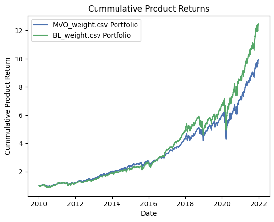
*Figure 2: MVO-BL-views2*
Figures 3 and 4 present pie charts visualizing the portfolio weights derived from the MVO and BL
methods, respectively. Both approaches encourage diversification, but with key differences.

- MVO: The MVO approach tends to allocate weights more equally across all assets, promoting a
    balanced portfolio distribution.
- BL: The BL method, in this specific case, allocates a slightly higher weight to assets like ’NVDA’
    and ’BRK-A’ compared to the MVO allocation.

```
Figure 3: MVO-portfolio Figure 4: BL-views2-portfolio

```
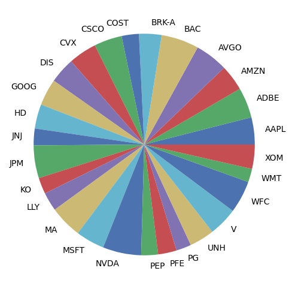
*Figure 1: MVO-portfolio*

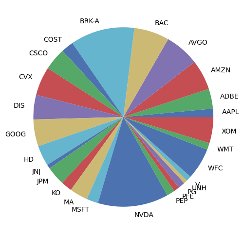
*Figure 2: BL-views2-portfolio*


0.3 Standard Machine Learning Methods: SVM and Decision tree,

comparison

```
Figure 5: Machine learning methods
```
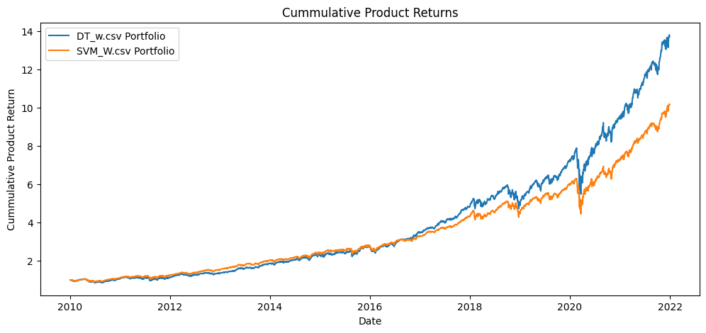
*Figure 3: Machine learning methods*
Figure 5 indicates that the Decision Tree method potentially outperforms the Support Vector Machine
(SVM) for portfolio optimization in this specific case. Furthermore, analyzing the pie charts Figures
6 and 7 reveals distinct investment strategies. Decision Tree Allocates a significant portion of the
investment to ’MSFT’ assets, followed by ’NVDA’. while SVM Tends towards a more equal distribution
of weights across all assets

```
Figure 6: SVM-portfolio Figure 7: DT-portfolio
```
 
*Figure 4: SVM-portfolio*

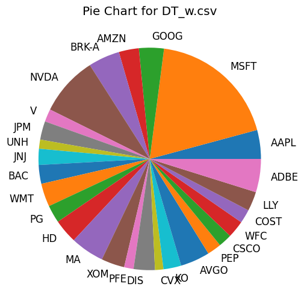
*Figure 5: DT-portfolio*

Section 0.4. Comparison with deep learning methods: LSTM Page 4

Having explored the performances of both traditional and machine learning methods, a comparative
analysis based on Figure 8 is presented. It highlights key observations:

```
Figure 8: Traditional and Machine Learning Methods
```
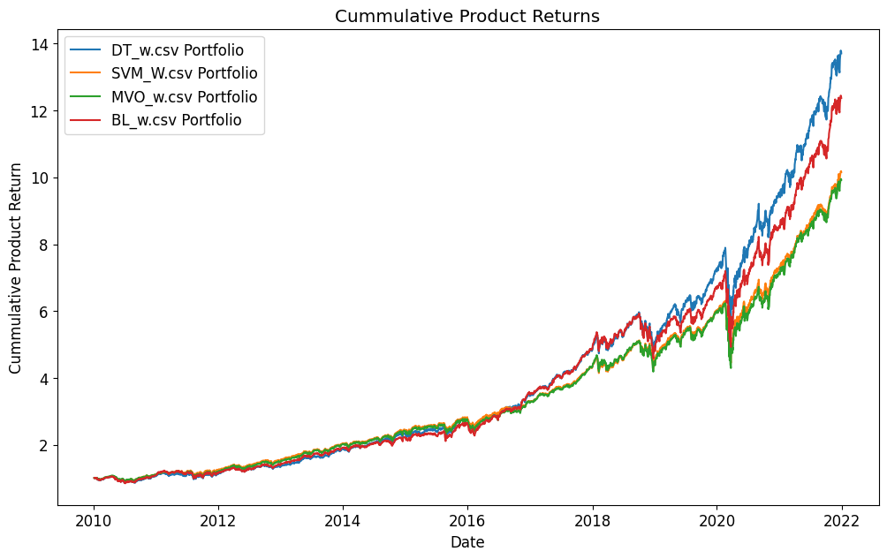
*Figure 6: Traditional and Machine Learning Methods*

- The Decision Tree method emerges
    as the leader in terms of returns in
    this scenario.
- The Black-Litterman approach fol-
    lows closely, potentially indicating
    the benefit of incorporating investor
    views.
- Mean-Variance Optimiza-
    tion(MVO) and Support Vector
    Machine(SVM) exhibit similar
    performance in terms of returns.

0.4 Comparison with deep learning methods: LSTM

We now have an idea of the performance of machine learning for portfolio optimization, let’s explore
the usefulness of the deep learning method in portfolio optimization.

```
Figure 9: LSTM methods
```

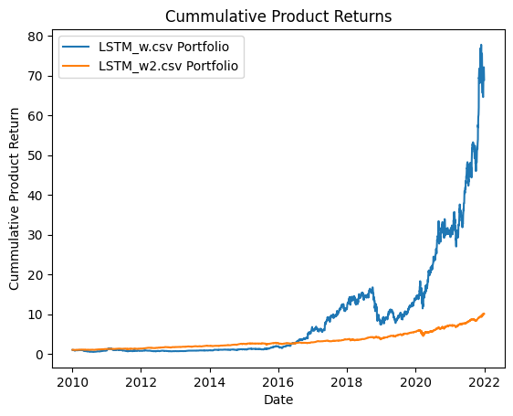
*Figure 7: LSTM methods*

Section 0.4. Comparison with deep learning methods: LSTM Page 5

As deep learning method, we investigate the application of Long Short-Term Memory (LSTM) networks
for portfolio optimization. LSTMs have the ability to learn and adapt their weight distribution based on
the chosen objective function.

Figure 9 illustrates this concept. It presents two scenarios with different objective functions for the
LSTM:

- Scenario 1 (Maximizing Return): The objective function here is designed to prioritize maximizing
    the portfolio’s return. In the resulting weight distribution, as shown in the pie chart 10, the LSTM
    favors the asset with higher expected returns which is the ’NVDA’.
- Scenario 2 (Return-Risk Trade-off): This scenario incorporates a more balanced objective function
    that aims to not only maximize return but also minimize risk. The LSTM’s weight distribution, as
    shown in the pie chart 11 reflects this balance, by allocating weights to assets that offer a balance
    between return potential and risk.

```
Figure 10: LSTM-portfolio Figure 11: LSTM-2 portfolio

```

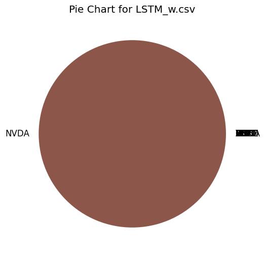
*Figure 8: LSTM-portfolio*

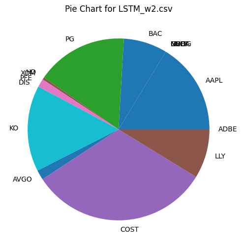
*Figure 9: LSTM-2 portfolio*

After exploring how LSTMs perform in portfolio optimization, let’s compare this method to the previously
mentioned approaches. Figure 12 shows the returns achieved by the LSTM strategy alongside the two
machine learning methods and the traditional approaches.

We can see that the LSTM strategy in the first scenario outperforms all others, followed by the decision
tree and the Black litterman method. The SVM and MVO methods have the lower returns. However,
the LSTM’s performance in the second scenario is significantly lower. This is because the second scenario
prioritizes minimizing risk, which may limit potential returns.


Section 0.5. Reinforcement learning methods Page 6

```
Figure 12: LSTM & other methods
```

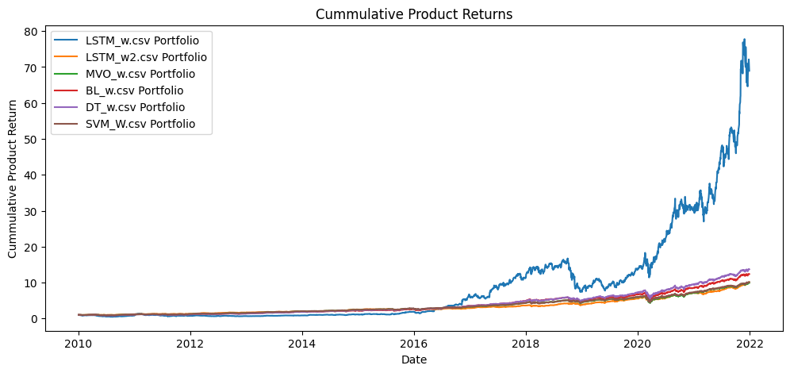
*Figure 10: LSTM & other methods*

0.5 Reinforcement learning methods

We now examine how reinforcement learning can be applied to portfolio optimization. We’ll utilize the
policy gradient and Q-learning approaches previously introduced in sections??and??, respectively.

Figure 13 illustrates that the policy gradient method outperforms the Q-learning method in this context.

```
Figure 13: RL-methods
```
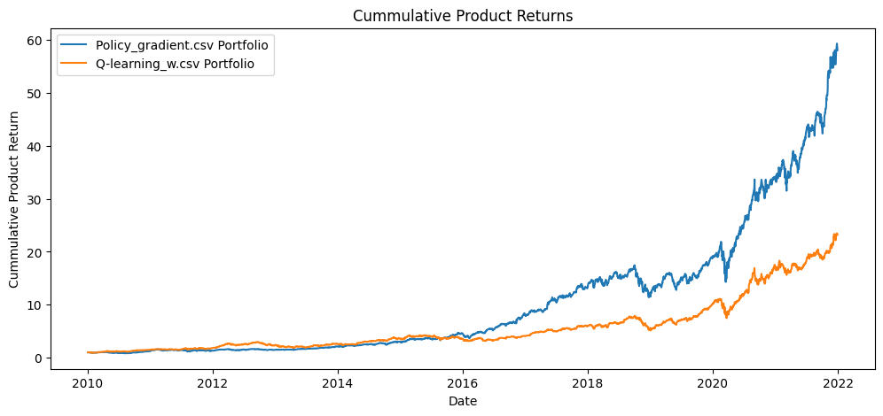
*Figure 11: RL-methods*

Let’s analyze the weight distribution of each method using pie charts (Figures 14 and 15). These
charts reveal a clear distinction in portfolio diversification between the Q-learning and policy-gradient


Section 0.5. Reinforcement learning methods Page 7

approaches.

From the charts, the Q-learning portfolio exhibits a less diversified allocation compared to the policy-
gradient portfolio, in the pie chart 14, a significant portion of the capital is invested in a single asset,
’AAPL’. This heavy concentration in one asset exposes the portfolio to greater risk if the performance
of ’AAPL’ deviates significantly from expectations.

In contrast, the policy-gradient portfolio (Figure 15) demonstrates a more balanced allocation across
assets. While it prioritizes ’NVDA’ and ’AVGO’, it also invests in ’AMZN’ and other assets. This
diversification helps mitigate risk by reducing the portfolio’s dependence on the performance of any
single asset.

```
Figure 14: Q-learning-portfolio Figure 15: policy-gradient-portfolio
```


*Figure 12: Q-learning-portfolio*

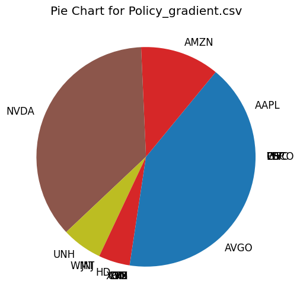
*Figure 13: policy-gradient-portfolio*
To acquire in-depth knowledge, let’s compare the performance of reinforcement learning methods against
the previously explored approaches (traditional and machine learning). Figure 16 reveals some key
observations:

- The LSTM strategy in scenario 1 emerges as the top performer in terms of returns. However,
    this comes at a significant cost: a highly concentrated portfolio heavily invested in a single asset.
    This concentration exposes the portfolio to substantial risk if the asset ’NVDA’ underperforms.
- In contrast, both reinforcement learning algorithms (policy gradient and Q-learning) demonstrate
    a compelling balance between performance and risk. They achieve high returns while maintaining
    a more diversified allocation across assets. This diversification mitigates risk by reducing the
    portfolio’s dependence on any single asset’s performance.
- The remaining methods, including traditional and machine learning approaches, generally exhibit
    lower performance compared to the reinforcement learning algorithms. While their diversification
    is moderate, their overall return potential appears limited.


Section 0.6. Performance Metrics and Evaluation Criteria Page 8

```
Figure 16: Comparison all methods
```
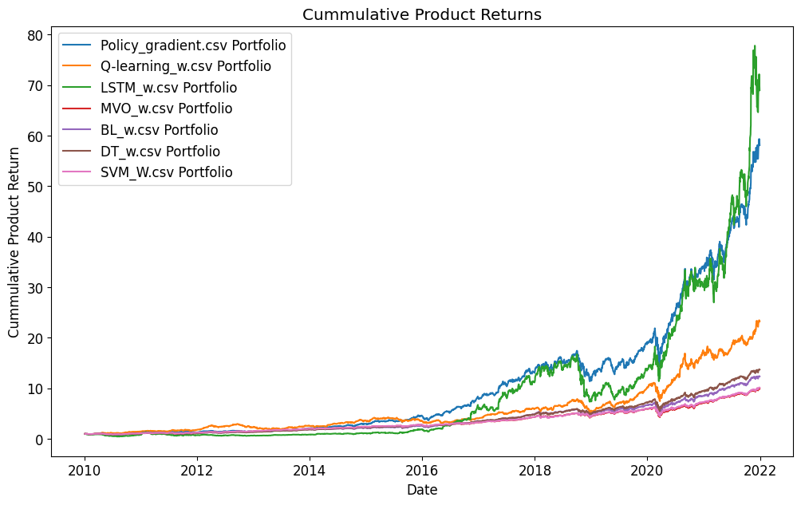
*Figure 14: Comparison all methods*
0.6 Performance Metrics and Evaluation Criteria

We end this chapter with a comparative analysis based on evaluation criteria such as the maximum
Drawdown, the Value at Risk, the Conditional value at risk defined in sections??,??, and??, respec-
tively.

```
Model Expected Return -Maximum Drawdown -VaR 95 -CVaR 95 Standard Dev
MVO 0.000820 31.16% 1.62% 2.64% 0.
BL 0.000902 31.55% 1.72% 2.81% 0.
SVM 0.000822 29.36% 1.52% 2.49% 0.
DT 0.000937 30.39% 1.71% 2.82% 0.
LSTM 1 0.001761 56.04% 3.83% 5.81% 0.
LSTM 2 0.000813 24.78% 1.38% 2.27% 0.
Policy Gradient 0.001498 34.76% 2.55% 4.00% 0.
Q-learning 0.001173 37.92% 2.42% 3.70% 0.
```
```
Figure 17: Table of performance metrics
```
The table 17 compares the performance of various portfolio optimization models based on several risk-
return metrics. From it we can extract the following interpretation:


Section 0.6. Performance Metrics and Evaluation Criteria Page 9

1. Expected Return column shows the average return each model expects to generate. LSTM of the
    has the highest expected return (0.001761), followed by Policy gradient (0.001498) and Q-learnig
    (0.001173).
2. Maximum Drawdown: This measures the largest peak-to-trough decline in portfolio value. While
    LSTM-1 boasts the highest return, it also has the highest maximum drawdown(56.04%), in-
    dicating a much riskier strategy. SVM and DT have the lowest maximum drawdown (around
    24-31%).
3. V aR− 95 &CV aR− 95 : V aR− 95 (Value at Risk) tells us the potential maximum loss we
    could experience with 95% confidence level.CV aR− 95 (Conditional VaR) is the expected loss
    given that a loss exceeding the VaR threshold occurs. Here, SVM and LSTM 2 have the lowest
    V aRandCV aRvalues, while the reinforcement learning methods appear a bit more risky, but
    acceptable.
4. Standard Deviation: This reflects the overall volatility of the portfolio’s returns. LSTM-1 again has
    the highest standard deviation (0.026867), further highlighting its volatility. SVM and LSTM-
    have the lowest standard deviations, while the reinforcement learning methods present an accept-
    able standard deviation.

Overall, although LSTM-1 presents the possibility of achieving the highest returns, it also carries the
greatest risk in terms of volatility and other risk metrics. Black litterman and Decision Tree take a more
balanced approach, offering moderate returns and lower risk. SVM also demonstrates potential with
lower risk indicators. Additionally, reinforcement learning methods present a promising portfolio option,
with high returns and an acceptable level of risk.

To clearly visualize the performance of each method, we present the table 18, analyzing their perfor-
mance, using the Sharpe ratio as a key metric, with a risk-free rate ofrf= 0. 00045.

```
Models MVO BL SVM DT LSTM-1 LSTM-2 PG Q-learning
Sharpe (× 10 −^2 ) 3.3882 3.8626 3.5920 4.1264 0.1183 3.7392 6.0185 4.
```
```
Figure 18: Sharpe ratio of each method
```
Key findings:

- Reinforcement Learning Dominance: The table reveals that the two reinforcement learning
    (policy gradient (PG), Q-learning) methods achieve the highest Sharpe ratios. This attests that
    RL techniques can outperform other methods in portfolio optimization.
- Deep Learning Potential: The contrast result of Scenario one and two of the LSTM highlights
    the crucial role of effective training for deep learning methods in achieving optimal performance.

Overall, the analysis emphasizes the effectiveness of reinforcement learning for portfolio optimization.
Additionally, it suggests the potential of deep learning with proper training. Further investigation into
deep learning techniques appears warranted, this motivates our study of the deep deterministic policy
gradient in section??.


